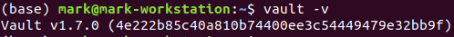

# Install

* Install Vault

## Lab Goals:

1. Install Vault on the OS of your choice
    * Install Vault
    * Verify the install

### Builds on:
    * None

### Time:
    * 15 min

### Step 1) Go to the HashiCorp website

* HashiCorp has excellent and most up-to-date documentation
* Go here [https://www.vaultproject.io/downloads](https://www.vaultproject.io/downloads)

  
* Chose the instructions for your OS
* (We tested on Ubuntu, Mac, and Windows)

### Step 2) Verify the install

* On the command line, run the following command

```shell
vault -v
```
* Your output should be similar to the following



### Congrats! You completed the lab

