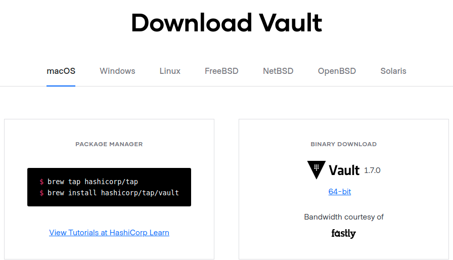
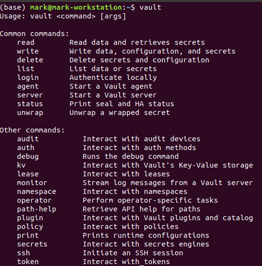

# Install

* Install Vault

## Lab Goals:

1. Install Vault on the OS of your choice
    * Install Vault
    * Verify the install

### Builds on:
    * None

### Time:
    * 15 min

### Step 1) Go to the HashiCorp website

* HashiCorp has excellent and most up-to-date documentation
* Go here [https://www.vaultproject.io/downloads](https://www.vaultproject.io/downloads)
* Here is a screenshot of what you should see


  
* Chose the instructions for your OS and follow these instructions
* (We tested on Ubuntu, Mac, and Windows)

### If you have an older Linux, you may have to do this
```shell```
curl -fsSL https://apt.releases.hashicorp.com/gpg | sudo apt-key add -
sudo apt-add-repository "deb [arch=amd64] https://apt.releases.hashicorp.com focal main"
/usr/bin/vault -v
```

### Step 2) Verify the install

* On the command line, run the following command

```shell
vault -v
```
* Your output should be similar to the following


### Step 3) Display vault commands

* On the command line, run the following command

```shell
vault
```

* You should see this output




### Congrats! You completed the lab

