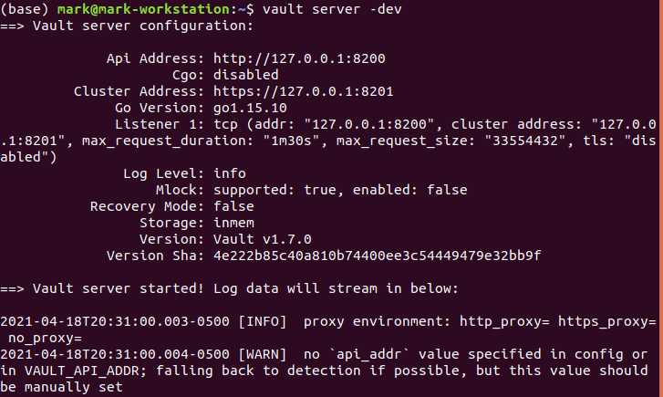
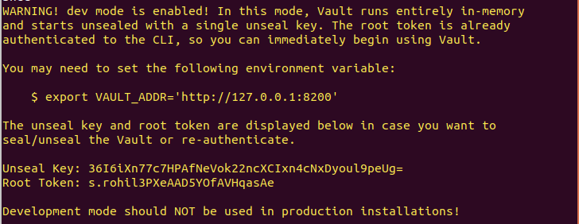
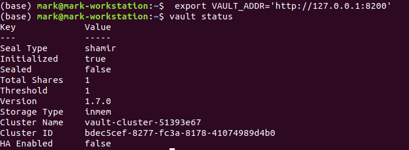

# Start the server

* Start the Vault server
* Vault operates as a client/server application. The Vault server is the only piece of the Vault architecture that interacts with the data storage and backends. All operations done via the Vault CLI interact with the server over a TLS connection.

## Lab Goals:

* In this lab, you will start and interact with the Vault server running in development mode.

### Builds on:
* [Install lab](../lab01)

### Time:
    * 15 min

### Step 1) Starting the Dev Server

* The dev server is a built-in, pre-configured server that is not very secure but useful for playing with Vault locally. 
* Later, in the Deploy Vault tutorial, you will configure and start a non-dev server.
* Run the following command

```shell
vault server -dev
```
* You will see an output similar to this



* You will also get this warning



*  Notice that Unseal Key and Root Token values are displayed.

* IMPORTANT

    * The dev server stores all its data in-memory (but still encrypted), listens on localhost without TLS, and automatically unseals and shows you the unseal key and root access key.
    * Keep this terminal running
    
### Step 2) Start working with the `dev` server

* Launch a new terminal session.

* Copy and run the export VAULT_ADDR ... command from the terminal output. This will configure the Vault client to talk to the dev server.

```shell
 export VAULT_ADDR='http://127.0.0.1:8200'
```

* Vault CLI determines which Vault servers to send requests using the VAULT_ADDR environment variable.

* Save the unseal key somewhere. Don't worry about how to save this securely. For now, just save it anywhere.

* Set the VAULT_TOKEN environment variable value to the generated Root Token value displayed in the terminal output.

* Example:

```shell
export VAULT_TOKEN="s.rohil3PXeAAD5YOfAVHqasAe"
```

* To interact with Vault, you must provide a valid token. Setting this environment variable is a way to provide the token to Vault via CLI. Later, in the Authentication tutorial, you will learn to use the vault login <token_value> command to authenticate with Vault.

### Step 3) Verify the Server is Running

* Run the following command in the second open terminal

```shell
vault status
```

* You should see an output similar to the one below



### Step 4) Congratulations! You've started your first Vault server.

* Later, we will be learning how to configure Vault for more real-world use. 
* For now, you will probably go to Your First Secret lab, where you will learn how to store secrets in Vault.