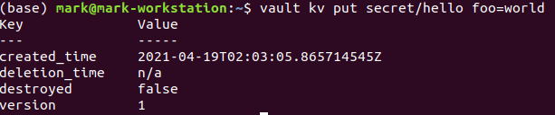
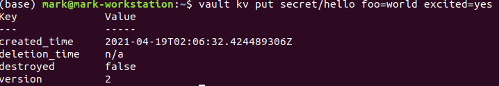
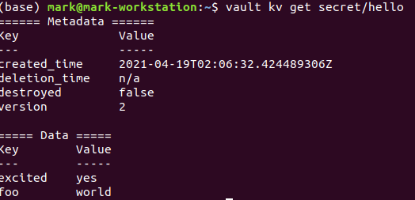
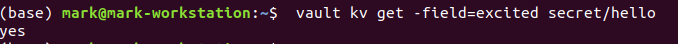
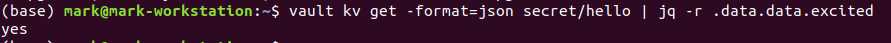
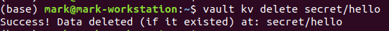

# Write your first secret

* Write your first secret.
* One of the core features of Vault is the ability to read and write arbitrary secrets securely. Secrets written to Vault are encrypted and then written to backend storage. Therefore, the backend storage mechanism **never** sees the unencrypted value and doesn't have the means necessary to decrypt it without Vault.

## Lab Goals:

* In this lab, you will write a secret to Vault, verify it by reading it back, and then delete it.

### Builds on:
* Previous labs, [install](../lab01) and [start](../lab02)

### Time:
    * 15 min

### Step 1) Writing a Secret

* Write a secret to Key/Value v2 secrets engine when running a dev server.
* (The kv secrets engine is used to store arbitrary secrets within the configured physical storage for Vault.)

* Use the vault kv put <path> <key>=<value> command.

```shell
vault kv put secret/hello foo=world

```

* You will see an output like this:


  
* This writes the pair foo=world to the path secret/hello. You'll learn paths in more detail later, but for now it is important that the path is prefixed with secret/, otherwise this example won't work. The secret/ prefix is where arbitrary secrets can be read and written.

### Step 2) Write multiple pieces of data.

* Run this command

```shell
vault kv put secret/hello foo=world excited=yes
```

* You should see an output similar to this



* Notice that the version is now 2. The vault kv put command creates a new version of the secrets and replaces any pre-existing data at the path if any.

**WARNING**

* The examples in this lab use the <key>=<value> input to send secrets to Vault. 
  However, sending data as a part of the CLI command often end up in the shell history unencrypted. 
* To avoid this, you should use files. 
  We will talk about it in the "Static Secrets: Key/Value Secrets Engine" lab.

### Step 3) Getting a Secret

* To read the secret back, you should use the `vault kv get <path>` command.

```shell
vault kv get secret/hello
```
* Your output will look as follows


  
* Vault returns the latest version (in this case version 2) of the secrets at secret/hello.

* To print only the value of a given field, use the -field=<key_name> flag.

```shell
vault kv get -field=excited secret/hello
```
* You will get this:



* Optional JSON output is very useful for scripts. 
* For example, you can use the jq tool to extract the value of the excited secret.

```shell
vault kv get -format=json secret/hello | jq -r .data.data.excited
```


### Step 4) Deleting a Secret

*  You can do so using the `vault kv delete` command.

```shell
vault kv delete secret/hello
```


### Step 5) Try to read the secret again

* Do that using previous steps

### Step 6) Congratulations!

* You learned how to use the powerful CRUD features of Vault to store arbitrary secrets.
* We used the secrets engine but we don't yet know about it. Our next step might be to
learn more about secrets engines.


