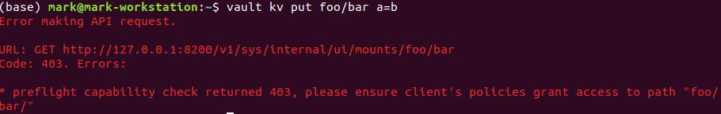
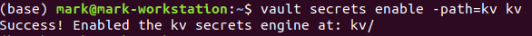
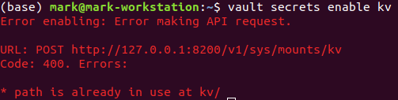
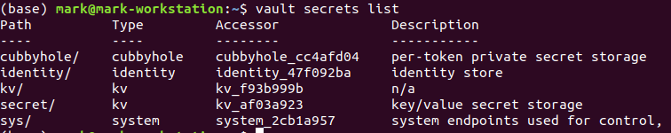
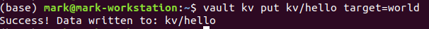
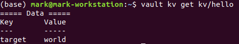
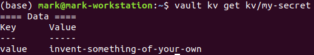
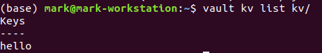

# Secrets Engines

* There are many secrets engines in Vault
* You must be conscious about which engine you are talking to

## Lab Goals:

* Learn to work with secrets engines

### Builds on:
* ["Write a secret" lab](../lab03)

### Time:
    * 15 min

### Step 1) Note the use of the `secrets` engine

* Please note that in the previous lab, all requests started with `secret/`
* Try to do without it, by running the following command (which should give you an **error**)

```shell
vault kv put foo/bar a=b
```

* You should get this



### Why is that?

* The path prefix tells Vault which secrets engine to which it should route traffic. When a request comes to Vault, it matches the initial path part using a longest prefix match and then passes the request to the corresponding secrets engine enabled at that path. Vault presents these secrets engines similar to a filesystem.

* By default, Vault enables Key/Value version2 secrets engine (kv-v2) at the path secret/ when running in dev mode. The key/value secrets engine reads and writes raw data to the backend storage. Vault supports many other secrets engines, and this feature makes Vault flexible and unique.

* **NOTE**
* The key/value secrets engine has two versions: kv (version 1) and kv-v2 (version 2). The kv-v2 is versioned kv secrets engine which can retain a number of secrets versions.
* This page discusses secrets engines and the operations they support. This information is important to both operators who will configure Vault and users who will interact with Vault.

### Step 2) Enable a Secrets Engine

* To get started, enable the `kv` secrets engine. 
Each path is completely isolated and cannot talk to other paths. For example, a `kv` secrets engine enabled at foo has no ability to communicate with a `kv` secrets engine enabled at bar.
  
* Now, enable a secrets engine by running the following command

```shell
vault secrets enable -path=kv kv
```

* You should get `success`



* The path where the secrets engine is enabled defaults to the name of the secrets engine. Thus, the following command is equivalent to executing the above command.
* Execute the following command and get an **error**

```shell
vault secrets enable kv
```



* To verify our success and get more information about the secrets engine, use the `vault secrets list` command:

```shell
vault secrets list
```

* You will get this output



* This shows there are a few enabled secrets engines on this Vault server. 
*  You can see the type of the secrets engine, the corresponding path, and an optional description (or "n/a" if none was given).

* NOTE:
* The sys/ path corresponds to the system backend. These paths interact with Vault's core system and are not required for beginners.

### Step 3) Write more data to the kv secrets engine

* Read and write some data to the new kv secrets engine enabled at kv/. Here are a few ideas to get started.

```shell
vault kv put kv/hello target=world
```



* To read the secrets stored in the kv/hello path, use the `kv get` command.

```shell
vault kv get kv/hello
```



* Create another secrets, at the kv/my-secret path.

```shell
vault kv put kv/my-secret value="invent-something-of-your-own"
```

* Read the secrets back

````shell
vault kv get kv/my-secret
````



* Except, of course, it should be a secret of your invention :)

* Delete the secrets at `kv/my-secret`

```shell
vault kv delete kv/my-secret
```

* Verify that delete worked

```shell
vault kv list kv/
```



### Step 4) Disable a Secrets Engine

* When a secrets engine is no longer needed, it can be disabled. When a secrets engine is disabled, all secrets are revoked and the corresponding Vault data and configuration is removed.

```shell
vault secrets disable kv/
```

* Note that this command takes a PATH to the secrets engine as an argument, not the TYPE of the secrets engine.

* Any requests to route data to the original path would result in an error, but another secrets engine could now be enabled at that path.

### Step 5) Summarize

* So, what is a Secrets Engine? 

* Now that you've successfully enabled and disabled a secrets engine... what is it? What is the point of a secrets engine?

* As mentioned above, Vault behaves similarly to a virtual filesystem. The read/write/delete/list operations are forwarded to the corresponding secrets engine, and the secrets engine decides how to react to those operations.

* This abstraction is incredibly powerful. It enables Vault to interface directly with physical systems, databases, HSMs, etc. But in addition to these physical systems, Vault can interact with more unique environments like AWS IAM, dynamic SQL user creation, etc. all while using the same read/write interface.

### Step 6) Congratulation

