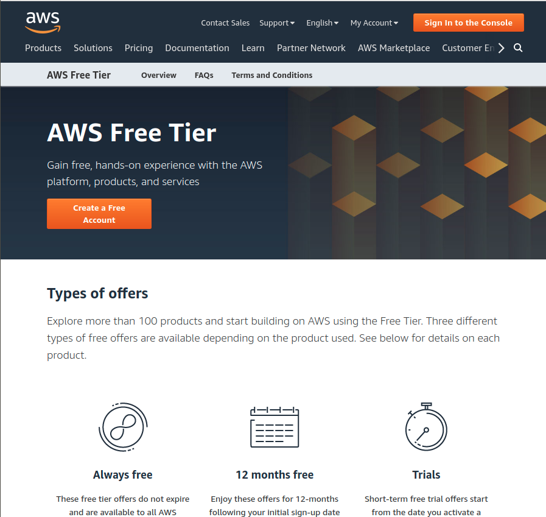
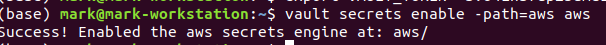
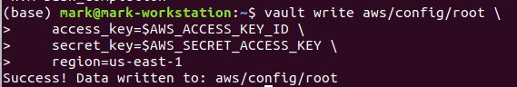
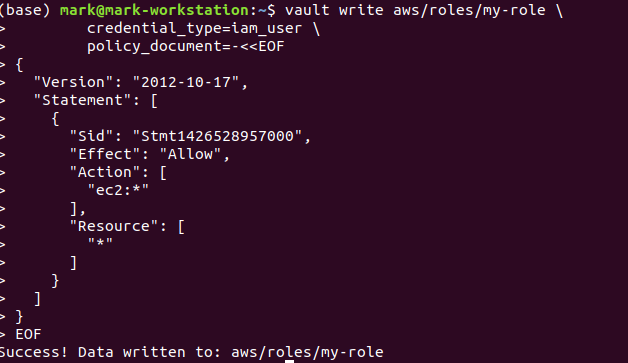
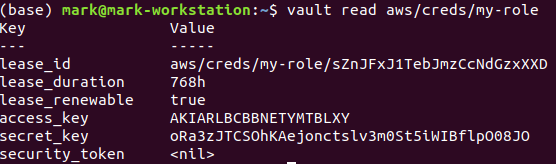
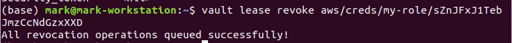

# Dynamic Secrets

* Static secret stay put and eventually become known
* Dynamic secret are a much more secure way

## Lab Goals:

* Learn to work with dynamic secrets

### Builds on:
* Previous labs

### Time:

    * 15 min

* Now that you've experimented with the kv secrets engine, it is time to explore another feature of Vault: dynamic secrets.

* Unlike the kv secrets where you had to put data into the store yourself, dynamic secrets are generated when they are accessed. Dynamic secrets do not exist until they are read, so there is no risk of someone stealing them or another client using the same secrets. Because Vault has built-in revocation mechanisms, dynamic secrets can be revoked immediately after use, minimizing the amount of time the secret existed.

Note: Before starting this page, please register for an AWS account. You won't be using any features that cost money, so you shouldn't be charged for anything. However, we are not responsible for any charges you may incur.

### Step 1) Register for an AWS account (or use one if you have it)



---

### Step 2) Enable the AWS secrets engine

* Unlike the `kv` secrets engine which is enabled by default, the AWS secrets engine must be enabled before use. This step is usually done via a configuration management system.

```shell
vault secrets enable -path=aws aws
```

* Vault should acknowledge success, like this:



* The AWS secrets engine is now enabled at aws/. Different secrets engines allow for different behavior. In this case, the AWS secrets engine generates dynamic, on-demand AWS access credentials.

### Step 3) Configure the AWS secrets engine

* After enabling the AWS secrets engine, you must configure it to authenticate and communicate with AWS. 
This requires privileged [AWS account credentials](https://docs.aws.amazon.com/general/latest/gr/aws-sec-cred-types.html).
  
* Set an `AWS_ACCESS_KEY_ID` environment variable to hold your AWS access key ID.

```shell
export AWS_ACCESS_KEY_ID=<aws_access_key_id>
```

* Set an AWS_SECRET_ACCESS_KEY environment variable to hold your AWS secret access key.

```shell
export AWS_SECRET_ACCESS_KEY=<aws_secret_key>
```

* I would not recommend using the root account credentials under any circumstances, even in class.
* Let's talk more about it.

* Configure the AWS secrets engine.

```shell
vault write aws/config/root \
    access_key=$AWS_ACCESS_KEY_ID \
    secret_key=$AWS_SECRET_ACCESS_KEY \
    region=us-east-1
```

* Confirm success of the configuration



* These credentials are now stored in this AWS secrets engine. The engine will use these credentials when communicating with AWS in future requests.

### Step 4) Create a role

* The next step is to configure a *role*. Vault knows how to create an IAM user via the AWS API, but it does not know what permissions, groups, and policies you want to attach to that user. This is where roles come in - a role in Vault is a human-friendly identifier to an action.

For example, here is an IAM policy that enables all actions on EC2, but not IAM or other AWS services.

```json
{
  "Version": "2012-10-17",
  "Statement": [
    {
      "Sid": "Stmt1426528957000",
      "Effect": "Allow",
      "Action": ["ec2:*"],
      "Resource": ["*"]
    }
  ]
}
```

* You need to map this policy document to a named role. 
To do that, write to `aws/roles/:name` where `:name` is your unique name that describes the role 
(such as `aws/roles/my-role`):
  
* Run this command

```shell
vault write aws/roles/my-role \
        credential_type=iam_user \
        policy_document=-<<EOF
{
  "Version": "2012-10-17",
  "Statement": [
    {
      "Sid": "Stmt1426528957000",
      "Effect": "Allow",
      "Action": [
        "ec2:*"
      ],
      "Resource": [
        "*"
      ]
    }
  ]
}
EOF
```

* Success! 



* Here is what you did. You just told Vault:

    * When I ask for a credential for "my-role", create it and attach the IAM policy { "Version": "2012..." }.
    
### Step 4) Generate the secret

* Now that the AWS secrets engine is enabled and configured with a role, 
  you can ask Vault to generate an access key pair for that role by reading from 
  `aws/creds/:name`, where `:name` corresponds to the name of an existing role:

```shell
vault read aws/creds/my-role
```

* And it worked:



* Success! The access and secret key can now be used to perform any EC2 operations within AWS. Notice that these keys are new, they are not the keys you entered earlier. If you were to run the command a second time, you would get a new access key pair. Each time you read from `aws/creds/:name`, Vault will connect to AWS and generate a new IAM user and key pair.

* Copy the full path of this lease_id value found in the output. This value is used for renewal, revocation, and inspection.

### Step 5) Revoke the secret

```shell
vault lease revoke aws/creds/my-role/sZnJFxJ1TebJmzCcNdGzxXXD
```



### Revoke all leases and delete the created IAM users

```shell
vault lease revoke -prefix aws/creds/my-role
```

### Step 6: Congratulations!

* Done! If you login to your AWS account, you will see that no IAM users exist. If you try to use the access keys that were generated, you will find that they no longer work.
