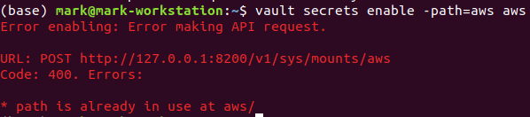
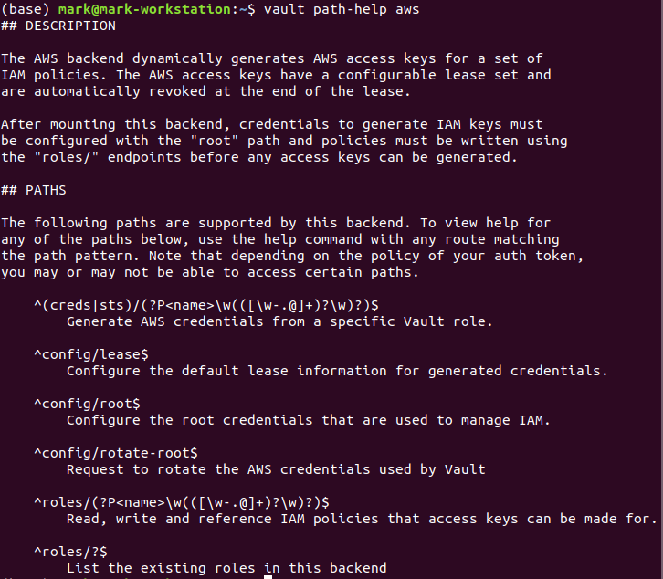
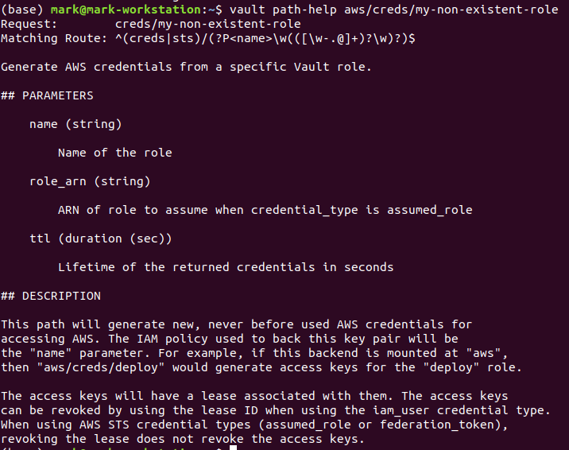

# Built-in Help

* You can notice that the structure and usage of each secrets engines differed
* For example the AWS backend has special paths like aws/config.
* The following lab will help.

## Lab Goals:

* Learn the Vault has a built-in help system. 
* This help system can be accessed via the API or the command-line and generates human-readable help for any path.

### Builds on:
* [Install lab](../lab01)

### Time:
    * 15 min

### Step 1) Look at Secrets Engines Overview

* This lab assumes you have the AWS secrets engine enabled at aws/. If you do not, enable it before continuing:

```shell
vault secrets enable -path=aws aws
```

* If you already enabled the secrets engine at `aws/`, you will get an error, like this



* That's normal.

* With the secrets engine enabled, learn about it with the vault path-help command:

```shell
vault path-help aws
```



* The vault path-help command takes a path. By specifying a root path, it will give us the overview of that secrets engine. Notice how the help not only contains a description, but also the exact regular expressions used to match routes for this backend along with a brief description of what the route is for.

### Step 2) Look at path help

* After seeing the overview, you can continue to dive deeper by getting help for an individual path. 
* For this, just use `vault path-help` with a path that would match the regular expression for that path. Note that the path doesn't need to actually work. 
* For example, you'll get the help below for accessing aws/creds/my-non-existent-role, even though you never created the role:

```shell
vault path-help aws/creds/my-non-existent-role
```

* You will get this help



* Within a path, you are given the parameters that this path requires. Some parameters come from the route itself. In this case, the name parameter is a named capture from the route regular expression. There is also a description of what that path does.

* Go ahead and explore more paths! Enable other secrets engines, traverse their help systems, and learn about what they do.

### Step 3) Congratulations!

* The help system may not be the most exciting feature of Vault, but it is indispensable in day-to-day usage. 
* The help system lets you learn about how to use any backend within Vault without leaving the command line.

