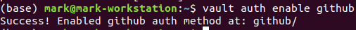

# Authentication

* In this lab, you will explore authentication with Vault tokens and GitHub credentials.

## Lab Goals:

* Having created secrets, static and dynamic, let's go deeper into authentication

### Builds on:
* [Install lab](../lab01)
* [Secrets lab](../lab05)

### Time:
    * 15 min

### Step 1) Token authentication

* Token authentication is automatically enabled. When you started the dev server, the output displayed a root token. The Vault CLI read the root token from the $VAULT_TOKEN environment variable. This root token can perform any operation within Vault because it is assigned the root policy. One capability is to create new tokens.
* Create a new token.

```shell
vault token create
```
You should get a token created, like this


* The token is created and the output describes this token a table of keys and values. The created token is displayed here as s.VprLdQ8xOIlfqASADzXtGTmf.

* This token is a child of the root token, and by default, it inherits the policies from its parent.

* Token is the core authentication method. 
  
* Now, you can use the generated token to login with Vault.

```shell
vault login s.VprLdQ8xOIlfqASADzXtGTmf 
## Put in your token!
```

* You should see success


### Step 3) Let's create another token.

```shell
vault token create
```


* The token is created and displayed here as `s.cf8oeieiRwevVt0nlnEx1hEP`. Each `token` that Vault creates is unique.

* When a token is no longer needed it can be revoked.

### Step 4) Revoke the token you have just created

```shell
vault token revoke s.VprLdQ8xOIlfqASADzXtGTmf 
```

* You should see success at that too


* The token has been revoked.

* An attempt to login with the revoked token will result in an error.

* Let's try!

```shell
vault login s.VprLdQ8xOIlfqASADzXtGTmf
```


* Revoking a token will also revoke all tokens that were created by the token.

* But our first token should be still working. Let us try that

```shell
vault login s.cf8oeieiRwevVt0nlnEx1hEP
```

* Success!


### Step 5) GitHub authentication

* Vault supports authentication methods for human operators. GitHub authentication enables a user to authenticate with Vault by providing their GitHub credentials and receive a Vault token.

* **NOTE**: This authentication method, as described in the exercises, requires that you have a GitHub profile, belong to a team in a GitHub organization, and have generated a GitHub access token with the read:org scope.

* Enable the GitHub auth method.

```shell
vault auth enable github
```

* Easy! Success.



* The auth method is enabled and available at the path auth/github/.

* This auth method requires that you set a GitHub organization in the configuration. A GitHub organization maintains a list of users which you are allowing to authenticate with Vault.

* Set the organization for the github authentication.

```shell
vault write auth/github/config organization=hashicorp
```

* Now all users within the hashicorp GitHub organization are able to authenticate.

* GitHub organizations can define teams. Each team may have access to different actions across all the repositories that the organization maintains. These teams may also need access to specific secrets within Vault.

* Configure the GitHub engineering team authentication to be granted the default and applications policies.

```shell
vault write auth/github/map/teams/engineering value=default,applications
```

* The members of the GitHub engineering team in the hashicorp organization will authenticate and are authorized with the default and applications policies.

* **NOTE**: The applications policy is not yet defined in Vault. Vault still allows users to authenticate but produces a warning until that policy is defined.

### Step 6) Display all the authentication methods that Vault has enabled.

```shell
vault auth list
```


* The output displays the github and token auth methods.

* Learn more about the github auth method using help.

```shell
vault auth help github
```


* Attempt to login with the github auth method.

```shell
vault login -method=github
```

* Gotcha!


* It did not work because you are (most likely) not a member of HashiCorp on GitHub.

* However, here is what you will need to do:

1) Login into GitHub.com
2) Follow [this instruction](https://docs.github.com/en/github/authenticating-to-github/creating-a-personal-access-token) to create your token on GitHub

* Here is what you will end up doing


* To be on the safe side, I only allowed access to public repositories. 
* It still did not work at first because it wanted more permissions


* Give it the required permissions


* And you will be able to log in


* When the GitHub personal access token is not provided to the command the Vault CLI prompts the operator. If a valid GitHub personal access token is provided then the operator logs in and the output displays a Vault token. The operator can use the Vault token until it is revoked or its lifetime exceeds the token_duration.


### Step 7) Revoke all tokens generated the github auth method.

```shell
 vault token revoke -mode path auth/github
```

* All tokens generated by logins to the path auth/github are revoked.

* All authentication methods, except for the token auth method, can be disabled.

* Display the github auth method.

```shell
vault auth disable github
```

* All tokens generated by logins using this authentication method are revoked.

* **NOTE** Because you have the VAULT_TOKEN environment variable set, the CLI commands will always use this value (the initial root token) unless the environment variable gets unset or overwritten by another token value.

### Step 8) Congratulations!

* Next, it would make sense to do the Authorization lab, to find out what you can do after you are authenticated


