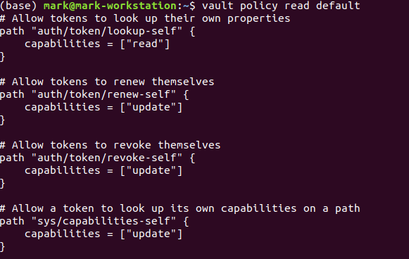
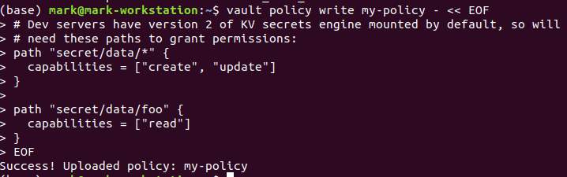
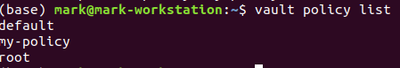
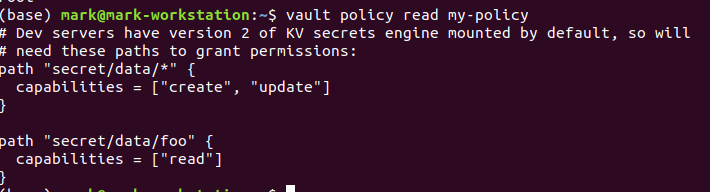
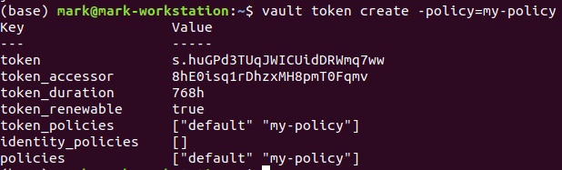
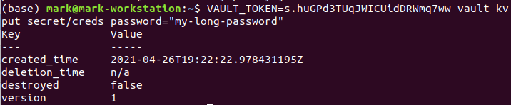
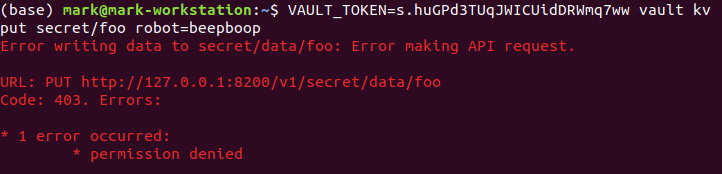
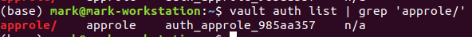
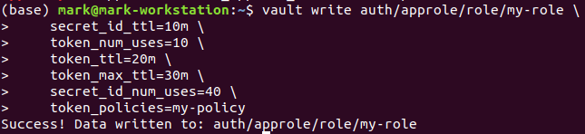
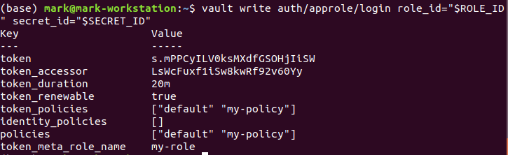

# Policies

* Policies is the Vault's way to provide authorization to authenticated users

## Lab Goals:

* Investigate the ways Vault uses for both authorization and policies. In fact, the same format is used for both. 
* Practice how the auth methods map identities 
* Use the core policies that are configured with Vault.

### Builds on:
* [Install lab](../lab01)

### Time:
    * 30 min

### Step 1) Inspect policy Format

* Policies are authored in HCL, but are JSON compatible. Here is an example policy:

```json
# Dev servers have version 2 of KV secrets engine mounted by default, so will
# need these paths to grant permissions:
path "secret/data/*" {
  capabilities = ["create", "update"]
}

path "secret/data/foo" {
  capabilities = ["read"]
}
```

* With this policy, a user could write any secret to secret/data/, except to secret/data/foo, where only read access is allowed. Policies default to deny, so any access to an unspecified path is not allowed.

* The policy format uses a prefix matching system on the API path to determine access control. The most specific defined policy is used, either an exact match or the longest-prefix glob match. Since everything in Vault must be accessed via the API, this gives strict control over every aspect of Vault, including enabling secrets engines, enabling auth methods, authenticating, as well as secret access.

* There are some built-in policies that cannot be removed. For example, the root and default policies are required policies and cannot be deleted. The default policy provides a common set of permissions and is included on all tokens by default. The root policy gives a token super admin permissions, similar to a root user on a linux machine.

* View the default policy.

```shell
vault policy read default
```

* You will get back something like this (we show only part)



### Step 2) Write a Policy

* You will be using the use `vault policy write` command. Review the command help.

* Here is a portion of the output

```text
vault policy write -h
Usage: vault policy write [options] NAME PATH

  Uploads a policy with name NAME from the contents of a local file PATH or
  stdin. If PATH is "-", the policy is read from stdin. Otherwise, it is
  loaded from the file at the given path on the local disk.

  Upload a policy named "my-policy" from "/tmp/policy.hcl" on the local disk:

      $ vault policy write my-policy /tmp/policy.hcl

  Upload a policy from stdin:

      $ cat my-policy.hcl | vault policy write my-policy -

HTTP Options:

  -address=<string>
      Address of the Vault server. The default is https://127.0.0.1:8200. This
      can also be specified via the VAULT_ADDR environment variable.
      
And so on...      
```

* Create the policy named my-policy with the contents from stdin (in Windows, you may need to use the bash shell, such as comes with git install).

```shell
vault policy write my-policy - << EOF
# Dev servers have version 2 of KV secrets engine mounted by default, so will
# need these paths to grant permissions:
path "secret/data/*" {
  capabilities = ["create", "update"]
}

path "secret/data/foo" {
  capabilities = ["read"]
}
EOF
```

* It should work, and you will get back the `success` status




* List the policies and find the one you just created

```shell
vault policy list
```




* View the contents of the newly created `my-policy` policy.

```shell
vault policy read my-policy
```

* You should see exactly the policy you just provided



### Step 3) Test the Policy

* The policy you created provides limited management of secrets defined for the KV-V2 secrets engine. Policies are attached to tokens that Vault generates directly or through its various auth methods.

* Create a token and add the my-policy policy.

```shell
vault token create -policy=my-policy
```

* You should get a familiar confirmation of token creation



* Copy the generated token value.

* The policy enables the create and update capabilities for every path within the secret/ engine except one.

* Write a secret to the path secret/data/creds.

```shell
VAULT_TOKEN=s.huGPd3TUqJWICUidDRWmq7ww 

vault kv put secret/creds password="my-long-password"
```

* Confirm success



* Be sure to replace my token with the token value you copied from your previous output. This overwrites the VAULT_TOKEN value which is currently set to the initial root token.

* **NOTE**: When you access a KV v2 secrets engine using the vault kv CLI commands, you can omit /data in the secret path.

* The secret is created successfully.

* The policy only enables the read capability for the secret/data/foo path. An attempt to write to this path results in a "permission denied" error.

* Attempt to write to the secret/data/foo path.

```shell
VAULT_TOKEN=s.huGPd3TUqJWICUidDRWmq7ww vault kv put secret/foo robot=beepboop
```

* Indeed, you get an error



* This policy defines a limited set of paths and capabilities. Without access to sys, commands like vault policy list or vault secrets list will not work.

### Step 4) Associate Policies to Auth Methods

* Vault itself is the single policy authority, unlike authentication where you can enable multiple auth methods.

* You can configure auth methods to automatically assign a set of policies to tokens created by authenticating with certain auth methods. The way this is done differs depending on the related auth method, but typically involves mapping a role to policies or mapping identities or groups to policies.

* For example, you can achieve this with the token_policies parameter when configuring a role for the AppRole auth method.

* First, check to verify that approle auth method has not been enabled at the path approle/.

```shell
vault auth list | grep 'approle/'
```

* If this command produces no output (i.e. approle/ is not listed), enable it before proceeding.

```shell
vault auth enable approle
```

* Now run the above command again. You should get an output like this



* Now, enable an AppRole role "my-role", to configure some basic token options and to attach the previously defined "my-policy" policy to all tokens that it creates when applications authenticate with the role.

```shell
vault write auth/approle/role/my-role \
    secret_id_ttl=10m \
    token_num_uses=10 \
    token_ttl=20m \
    token_max_ttl=30m \
    secret_id_num_uses=40 \
    token_policies=my-policy
```

* Success in this instance looks like this



* You can validate that this AppRole role is attaching the policy by authenticating with the auth method.

* To authenticate with AppRole, first fetch the role ID, and capture its value in a ROLE_ID environment variable.

```shell
export ROLE_ID="$(vault read -field=role_id auth/approle/role/my-role/role-id)"
```

* Verify it by `echo`ing

```shell
echo $ROLE_ID
```

* Next, get a secret ID (which is similar to a password for applications to use for AppRole authentication), and capture its value in the SECRET_ID environment variable.

```shell
export SECRET_ID="$(vault write -f -field=secret_id auth/approle/role/my-role/secret-id)"
```

* Test it by `echo`ing if you want

* Finally, authenticate to AppRole with vault write by specifying the role path and passing the role ID and secret ID values with the respective options.

```shell
vault write auth/approle/login role_id="$ROLE_ID" secret_id="$SECRET_ID"
```

You should the final output, the crowning achievement of our lab



* Note that "my-policy" policy is contained in the policies and token_policies fields.

* **About policy fields**: As shown in the example output, the token has three similarly named fields, 
  policies, identity_policies, and token_policies. 
* The difference in these fields is that token_policies represent all policies attached to the token by auth methods, and identity_policies represents all policies attached to the token by the Identity secrets engine. 
* The policies field is a correlation of identity_policies and token_policies to show you all available policies for a given token. We will learn more in the `Identity: Entities and Groups` lab later on.

### Step 5) Congratulations! You completed the `Policies` lab.

* Policies are an important part of Vault. While using the root token is easiest to get up and running, you will want to restrict access to Vault very quickly, and the policy system is the way to do this.

* The syntax and function of policies is easy to understand and work with, and because auth methods all must map to the central policy system, you only have to learn this policy system.
