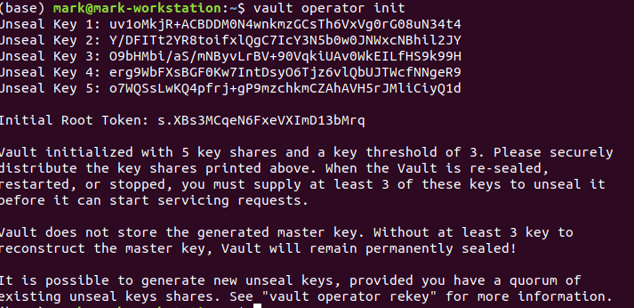

# Deploy Vault

* Deploy Vault in ways you would do it in production

## Lab Goals:

* Configure and deploy Vault 
* Practice real-life deployment 

### Builds on:
* [Install lab](../lab01)

### Time:
    * 30 min

### Step 1) Undo the `dev` deployment of Vault

* Up to this point, you interacted with the "dev" server, which automatically unseals Vault, sets up in-memory storage, etc. Now that you know the basics of Vault, it is important to learn how to deploy Vault into a real environment.

* Press **Ctrl+C** to terminate the dev server that is running at `http://127.0.0.1:8200` before start.

* Also, unset the VAULT_TOKEN environment variable.

```shell
unset VAULT_TOKEN
```

* In this lab, you will learn how to configure Vault, start Vault, use the seal/unseal process, and scale Vault.

### Step 2) Configuring Vault

* Vault is configured using [HCL](https://github.com/hashicorp/hcl) files. 
  The configuration file for Vault is relatively simple:
  
```HCL
storage "raft" {
  path    = "./vault/data"
  node_id = "node1"
}

listener "tcp" {
  address     = "127.0.0.1:8200"
  tls_disable = "true"
}

api_addr = "http://127.0.0.1:8200"
cluster_addr = "https://127.0.0.1:8201"
ui = true
```

* **NOTE** Although the listener stanza disables TLS (tls_disable = "true") for this tutorial, Vault should always be used with TLS in production to provide secure communication between clients and the Vault server. It requires a certificate file and key file on each Vault host.

* Within the configuration file, there are two primary configurations:

  * `storage` - This is the physical backend that Vault uses for storage. Up to this point the dev server has used "inmem" (in memory), but the example above uses integrated storage (raft), a much more production-ready backend.

  * `listener` - One or more listeners determine how Vault listens for API requests. The example above listens on localhost port 8200 without TLS. In your environment set VAULT_ADDR=http://127.0.0.1:8200 so the Vault client will connect without TLS.

  * `api_addr` - Specifies the address to advertise to route client requests.

  * `cluster_addr` - Indicates the address and port to be used for communication between the Vault nodes in a cluster.

* For now, copy and paste the configuration above to a file called config.hcl.

### Step 2) Starting the Server

* The ./vault/data directory that raft storage backend uses must exist

```shell
 mkdir -p ./vault/data
```
  
* Set the -config flag to point to the proper path where you saved the configuration above.

```shell
vault server -config=config.hcl
```

* The server should start:


* **NOTE**: If you get a warning message about mlock not being supported, that is okay. However, for maximum security you should run Vault on a system that supports mlock.

* Vault outputs some information about its configuration, and then blocks. This process should be run using a resource manager such as systemd or upstart.

* For potential problem if running on Linux, see [here](../note1.md)

### Step 3) Initializing the Vault

* Initialization is the process of configuring Vault. This only happens once when the server is started against a new backend that has never been used with Vault before. When running in HA mode, this happens once per cluster, not per server. During initialization, the encryption keys are generated, unseal keys are created, and the initial root token is setup.

* Launch a new terminal session, and set VAULT_ADDR environment variable.

```shell
export VAULT_ADDR='http://127.0.0.1:8200'
```

* To initialize Vault use vault operator init. This is an unauthenticated request, but it only works on brand new Vaults without existing data:

```shell
vault operator init
```

* You will get this kind of output



* Initialization outputs two incredibly important pieces of information: the unseal keys and the initial root token. This is the only time ever that all of this data is known by Vault, and also the only time that the unseal keys should ever be so close together.

* For the purpose of this lab, save all of these keys somewhere, and continue. In a real deployment scenario, you would never save these keys together. Instead, you would likely use Vault's PGP and Keybase.io support to encrypt each of these keys with the users' PGP keys. This prevents one single person from having all the unseal keys. 
  Please see the documentation on using [PGP, GPG, and Keybase](https://www.vaultproject.io/docs/concepts/pgp-gpg-keybase) for more information.
  
* You will see the output like below - please read the notes

### Step 3) Seal/Unseal

* Every initialized Vault server starts in the sealed state. From the configuration, Vault can access the physical storage, but it can't read any of it because it doesn't know how to decrypt it. The process of teaching Vault how to decrypt the data is known as unsealing the Vault.

* Unsealing has to happen every time Vault starts. It can be done via the API and via the command line. To unseal the Vault, you must have the threshold number of unseal keys. In the output above, notice that the "key threshold" is 3. This means that to unseal the Vault, you need 3 of the 5 keys that were generated.

* **Note**: Vault does not store any of the unseal key shards. Vault uses an algorithm known as Shamir's Secret Sharing to split the master key into shards. Only with the threshold number of keys can it be reconstructed and your data finally accessed.

* Begin unsealing the Vault:

```shell
vault operator unseal
```


* After pasting in a valid key and confirming, you see that Vault is still sealed, but progress is made. Vault knows it has 1 key out of 3. Due to the nature of the algorithm, Vault doesn't know if it has the correct key until the threshold is reached.

* Also notice that the unseal process is stateful. You can go to another computer, use vault operator unseal, and as long as it's pointing to the same server, that other computer can continue the unseal process. This is incredibly important to the design of the unseal process: multiple people with multiple keys are required to unseal the Vault. The Vault can be unsealed from multiple computers and the keys should never be together. A single malicious operator does not have enough keys to be malicious.

* Continue with vault operator unseal to complete unsealing the Vault. To unseal the vault you must use three different unseal keys, the same key repeated will not work.

```shell
vault operator unseal
```


```shell
vault operator unseal
```

* Unsealed!


* When the value for Sealed changes to false, the Vault is unsealed.

* Feel free to play around with entering invalid keys, keys in different orders, etc. in order to understand the unseal process.

* Finally, authenticate as the initial root token (it was included in the output with the unseal keys):

```shell
vault login <Initial_Root_Token>
```

* In my case,

```shell
vault login s.XBs3MCqeN6FxeVXImD13bMrq
```

* You will be successfully authenticated


* As a root user, you can reseal the Vault with vault operator seal. A single operator is allowed to do this. This lets a single operator lock down the Vault in an emergency without consulting other operators.

* When the Vault is sealed again, it clears all of its state (including the encryption key) from memory. The Vault is secure and locked down from access.

### Step 3) Clean up

* Either press Ctrl+C to stop the server.

* Or, kill the Vault process from a command.

```shell
ps aux | grep "vault server" | grep -v grep | awk '{print $2}' | xargs kill
```

* Now, delete the ./vault/data directory which stores the encrypted Vault data.

### Step 4) Congratulations!

* You now know how to configure, initialize, and unseal/seal Vault. This is the basic knowledge necessary to deploy Vault into a real environment. Once the Vault is unsealed, you access it as you have throughout this getting started tutorial (which worked with an unsealed Vault).


