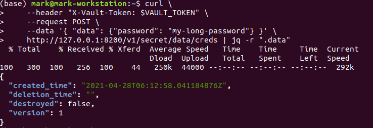

# Using the HTTP APIs with Authentication

* Access Vault with HTTP APIs
* All of Vault's capabilities are accessible via the HTTP API in addition to the CLI. 
* In fact, most calls from the CLI actually invoke the HTTP API. In some cases, Vault features are not available via the CLI and can only be accessed via the HTTP API.
  
## Lab Goals:

*  
*  

### Builds on:
* [Install lab](../lab01)

### Time:
    * 30 min

### Step 1) Prepare
  
* Press Ctrl+C to terminate the dev server if you are running it at at http://127.0.0.1:8200 before proceeding.

* Machines that need access to information stored in Vault will most likely access Vault via its REST API. For example, if a machine were using AppRole for authentication, the application would first authenticate to Vault which would return a Vault API token. The application would use that token for future communication with Vault.

### Step 2) Start the Vault server

* Create a server configuration file, config.hcl.

* For the purpose of this lab, you will use the following configuration which disables TLS and uses a file-based backend. TLS is disabled here only for example purposes; it should **never** be disabled in production.

```shell
tee config.hcl <<EOF
storage "file" {
  path = "vault-data"
}

listener "tcp" {
  tls_disable = "true"
}
EOF
```

* You might have already had the `config.hcl`, and this command will overwrite it. Alternatively, create the file using an editor.

* Start a new Vault instance using the newly created configuration.

```shell
vault server -config=config.hcl
```

* At this point, you can use Vault's HTTP API for all your interactions.

* Launch a new terminal session, and use curl to initialize Vault with the API.

* **NOTE**: This example uses jq to process the JSON output for readability.

```shell
curl \
    --request POST \
    --data '{"secret_shares": 1, "secret_threshold": 1}' \
    http://127.0.0.1:8200/v1/sys/init | jq
```

* The response should be JSON and looks something like this:


* This response contains your initial root token. It also includes the unseal key. You can use the unseal key to unseal the Vault and use the root token perform other requests in Vault that require authentication.

* To make this lab easy to copy-and-paste, you will be using the environment variable $VAULT_TOKEN to store the root token.

Example:

```shell
export VAULT_TOKEN="s.iJbNzzIR0T5xUkZ1p2vQMVq9"
```

* Using the unseal key (not the root token) from above, you can unseal the Vault via the HTTP API.

```shell
curl \
    --request POST \
    --data '{"key": "MAWmakiRveqpNkjv7VHs/4UXfbyBB7tMraQyQXt5Sw0="}' \
    http://127.0.0.1:8200/v1/sys/unseal | jq
```

* Note that you should replace the `MAWmakiRveqpNkjv7VHs/4UXfbyBB7tMraQyQXt5Sw0=` with the generated key from your output. This will return a JSON response:

* You should get success


### Step 3) Invoke the Vault API

* You can invoke the Vault API to validate the initialization status.

```shell
curl http://127.0.0.1:8200/v1/sys/init
```


* Now any of the available auth methods can be enabled and configured. For the purposes of this lab lets enable AppRole authentication.

* The Authentication lab showed how to enable the GitHub auth method using Vault CLI. It was this:

```shell
vault auth enable <auth_method_type>
```

* Moreover, to see the cURL equivalent of the CLI command to enable AppRole auth method, use the -output-curl-string flag.

* The final command form is

```shell
vault auth enable -output-curl-string approle
```

* You should get this result


* Enable the AppRole auth method by invoking the Vault API.

```shell
curl \
    --header "X-Vault-Token: $VAULT_TOKEN" \
    --request POST \
    --data '{"type": "approle"}' \
    http://127.0.0.1:8200/v1/sys/auth/approle
```

* Notice that the request to enable the AppRole endpoint needed an authentication token. In this case you are passing the root token generated when you started the Vault server. You could also generate tokens using any other authentication mechanisms, but you will use the root token for simplicity.

* Now create an AppRole with desired set of ACL policies.

* The Policies tutorial used CLI to create my-policy. In this tutorial, use the /sys/policies/acl endpoint to create the same policy via Vault API.

```shell
curl \
    --header "X-Vault-Token: $VAULT_TOKEN" \
    --request PUT \
    --data '{"policy":"# Dev servers have version 2 of KV secrets engine mounted by default, so will\n# need these paths to grant permissions:\npath \"secret/data/*\" {\n  capabilities = [\"create\", \"update\"]\n}\n\npath \"secret/data/foo\" {\n  capabilities = [\"read\"]\n}\n"}' \
    http://127.0.0.1:8200/v1/sys/policies/acl/my-policy
```

* Since my-policy expects secret/data path to exist, enable KV v2 secrets engine at secret/ using API.

```shell
curl \
    --header "X-Vault-Token: $VAULT_TOKEN" \
    --request POST \
    --data '{ "type":"kv-v2" }' \
    http://127.0.0.1:8200/v1/sys/mounts/secret
```

* The following command specifies that the tokens issued under the AppRole my-role should be associated with my-policy.

```shell
curl \
    --header "X-Vault-Token: $VAULT_TOKEN" \
    --request POST \
    --data '{"policies": ["my-policy"]}' \
    http://127.0.0.1:8200/v1/auth/approle/role/my-role
```

* The AppRole auth method expects a RoleID and a SecretID as its input. The RoleID is similar to a username and the SecretID can be thought as the RoleID's password.

* The following command fetches the RoleID of the role named my-role.

```shell
curl \
    --header "X-Vault-Token: $VAULT_TOKEN" \
     http://127.0.0.1:8200/v1/auth/approle/role/my-role/role-id | jq -r ".data"
```

* After all the above commands which did not produce an output, here one finally


* Please note that the response will include the role_id

```json
{
  "role_id": "947ad068-6804-aea1-ce78-c97fcf4aab87"
}
```

* The next command creates a new SecretID under the my-role.

```shell
curl \
    --header "X-Vault-Token: $VAULT_TOKEN" \
    --request POST \
    http://127.0.0.1:8200/v1/auth/approle/role/my-role/secret-id | jq -r ".data"
```


* Please note that the response will include the secret_id:

```json
{
  "secret_id": "43a15ecd-4cba-4d50-3b3f-09b911c1cd4e",
  "secret_id_accessor": "01ec1940-d95a-376f-a862-932049f79418",
  "secret_id_ttl": 0
}
```

* These two credentials can be supplied to the login endpoint to fetch a new Vault token.
* Note that you will have to replace the role_id and secret_id with your values, the ones you got in doing this lab.

```shell
curl --request POST \
       --data '{"role_id": "947ad068-6804-aea1-ce78-c97fcf4aab87", "secret_id": "43a15ecd-4cba-4d50-3b3f-09b911c1cd4e"}' \
       http://127.0.0.1:8200/v1/auth/approle/login | jq -r ".auth"
```

* Then you will get an output like this


* The response will be JSON, under the key auth (which we show with the help of `jq` command:

```json
{
  "client_token": "s.HluEtTApN8Bq3YyhsN0TA7Hd",
  "accessor": "ES25bpPxLnrfQRjebY41r2Tc",
  "policies": [
    "default",
    "my-policy"
  ],
  "token_policies": [
    "default",
    "my-policy"
  ],
  "metadata": {
    "role_name": "my-role"
  },
  "lease_duration": 2764800,
  "renewable": true,
  "entity_id": "1d722878-35f9-56a4-dd9b-85ee336b54d0",
  "token_type": "service",
  "orphan": true
}
```

The returned client token (`s.HluEtTApN8Bq3YyhsN0TA7Hd`) can be used to authenticate with Vault. This token will be authorized with specific capabilities on all the resources encompassed by the default and my-policy policies. (As it was mentioned in the Policies tutorial, the default policy is attached to all tokens by default. )

The newly acquired token can be exported as the VAULT_TOKEN environment variable value and used to authenticate subsequent Vault requests.

```shell
export VAULT_TOKEN="s.HluEtTApN8Bq3YyhsN0TA7Hd"
```

* Create a version 1 of secret named creds with a key password and its value set to my-long-password.

```shell
curl \
    --header "X-Vault-Token: $VAULT_TOKEN" \
    --request POST \
    --data '{ "data": {"password": "my-long-password"} }' \
    http://127.0.0.1:8200/v1/secret/data/creds | jq -r ".data"
```

* Your output will look like this



### Step 4) Clean up

* You can stop the server and unset the VAULT_TOKEN environment variable.

```shell
 unset VAULT_TOKEN
```

### Step 5) Congratulation! You completed the HTTP API lab. Thank you.

* You can see the documentation on the [HTTP APIs](https://www.vaultproject.io/api) for more details on other available endpoints.

* Congratulations! You now know all the basics needed to get started with Vault.

