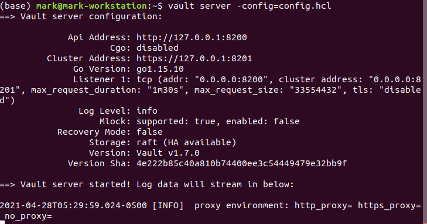
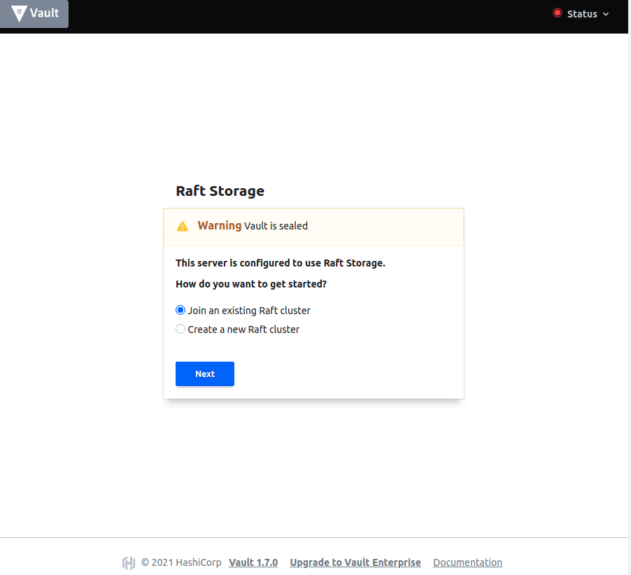
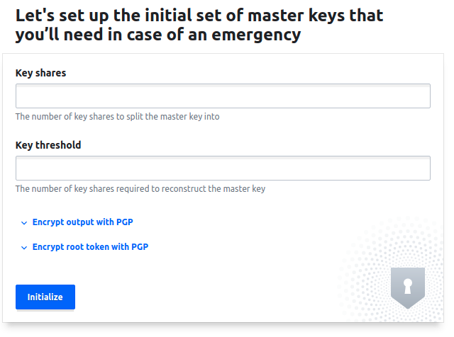
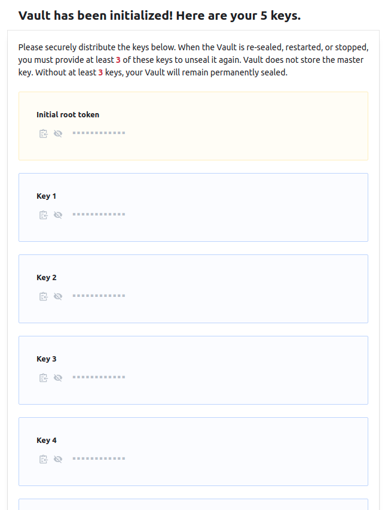
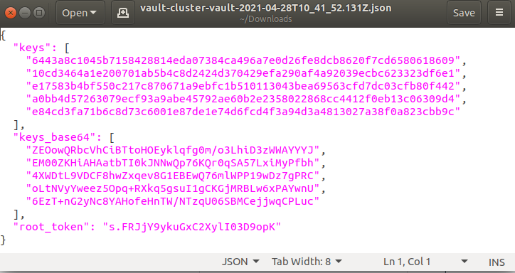
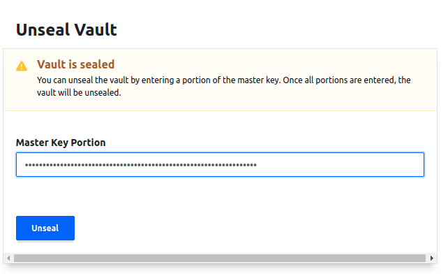
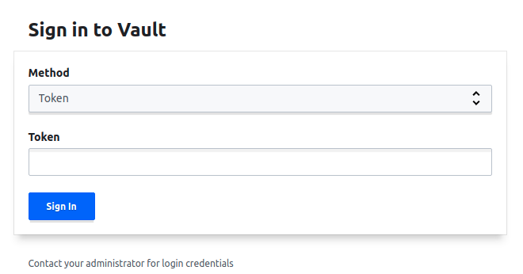
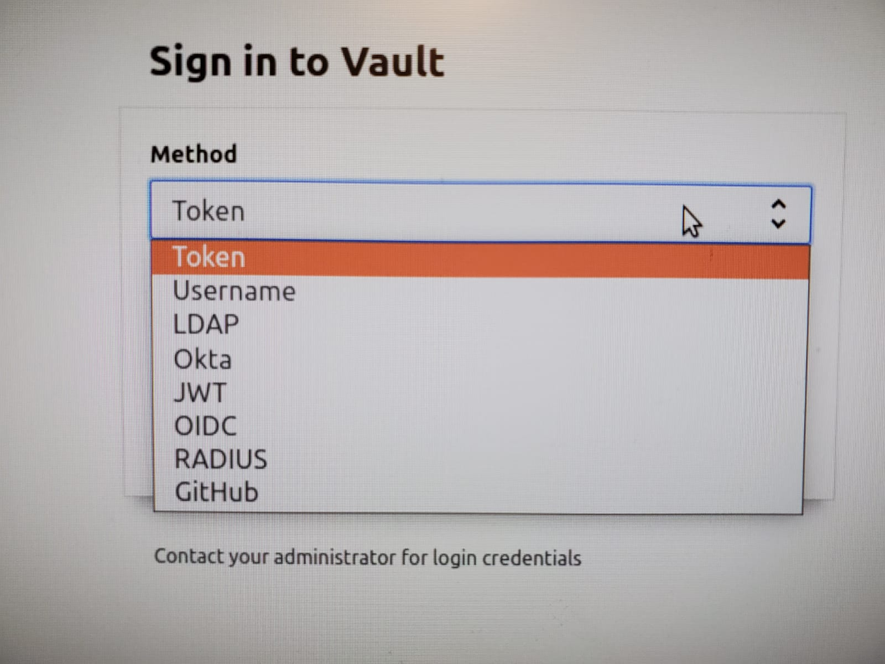
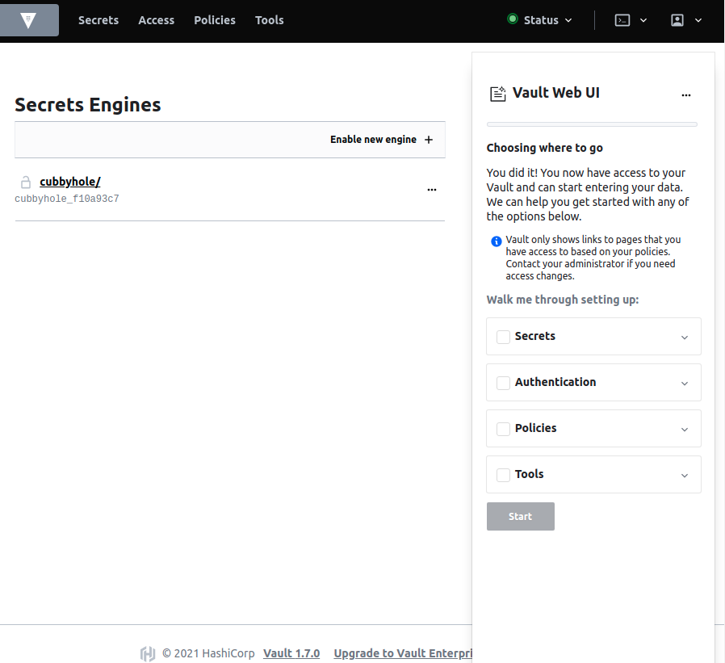
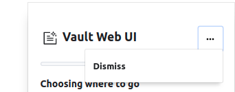

# Web UI

* Vault features a web-based user interface (UI) that enables you to unseal, authenticate, manage policies and secrets engines.  

## Lab Goals:

* Use Web UI with Vault

### Builds on:
* [Install lab](../lab01)

### Time:
    * 30 min

### Step 1) Prepare
  
* Press Ctrl+C to terminate the dev server if you are running it at http://127.0.0.1:8200 before proceeding.

### Step 2) Server Configuration

* The Vault UI is not activated by default. To activate the UI, set the ui configuration option in the Vault server configuration. Here is this section:

```text
ui = true

listener "tcp" {
  # ...
}

storage "storage" {
  # ...
}
```

* The UI runs on the same port as the Vault listener. As such, you must configure at least one listener stanza in order to access the UI.
* Here is a section

```text
ui = true

listener "tcp" {
  address = "10.0.1.35:8200"

  # If bound to localhost, the Vault UI is only
  # accessible from the local machine!
  # address = "127.0.0.1:8200"
}
# ...
```

* In this case, the UI is accessible at the following URL from any machine on the subnet (provided no network firewalls are in place): https://10.0.1.35:8200/ui

* It is also accessible at any DNS entry that resolves to that IP address, such as the Consul service address (if using Consul): https://vault.service.consul:8200/ui

* **NOTE**: When you start the Vault server in dev mode, Vault UI is automatically enabled and ready to use.

### Step 3) Start Web UI

* Create server configuration file named config.hcl

```shell
tee config.hcl <<EOF
ui = true
disable_mlock = true

storage "raft" {
  path    = "./vault/data"
  node_id = "node1"
}

listener "tcp" {
  address     = "0.0.0.0:8200"
  tls_disable = "true"
}

api_addr = "http://127.0.0.1:8200"
cluster_addr = "https://127.0.0.1:8201"
EOF
```

* The raft storage backend requires the filesystem path ./vault/data.

* Although the listener stanza disables TLS (tls_disable = "true") for this tutorial, Vault should always be used with TLS in production to provide secure communication between clients and the Vault server. It requires a certificate file and key file on each Vault host.

* Create the vault/data directory for the storage backend.

```shell
mkdir -p ./vault/data
```

* Start a Vault server with server configuration file named config.hcl

```shell
vault server -config=config.hcl
```

* Your output should be similar to this:



### Step 4) Launch the web browser

* Launch a web browser, and enter http://127.0.0.1:8200/ui in the address.

* Here is what you should see



* The Vault server is uninitialized and sealed. Before continuing, the server's storage backend requires starting a cluster or joining a cluster.

* Select Create a new Raft cluster and click Next. Here is what you will see



* Enter `5` in the Key shares and `3` in the Key threshold text fields.



* Click Initialize.

* When the unseal keys are presented, scroll down to the bottom and select Download key. Save the generated unseal keys file to your computer.

* The unseal process requires these keys and the access requires the root token.

* Open the downloaded file. That's how it opened on Ubuntu, for you, it may look different.



* Click Continue to Unseal to proceed.

* Copy one of the keys (not keys_base64) and enter it in the Master Key Portion field. Click Unseal to proceed.

* The Unseal status shows 1/3 keys provided.



* Enter another key and click Unseal.

* The Unseal status shows 2/3 keys provided.

* Enter another key and click Unseal.

* After 3 out of 5 unseal keys are entered, Vault is unsealed and is ready to operate.



* If before proceeding you click on the auth selector, you will see these options



* Copy the root_token and enter its value in the Token field. Click Sign in.



### Step 4) Web UI Wizard



* Go through the UI tutorial if you want, or do it later

### Step 5) Congratulation

* You have completed the Web UI lab

