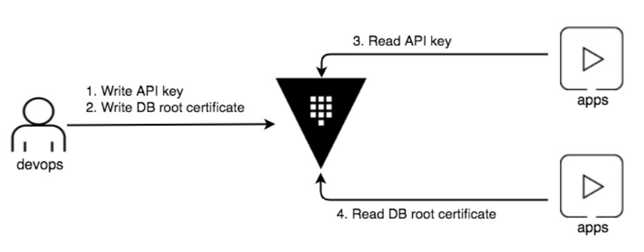
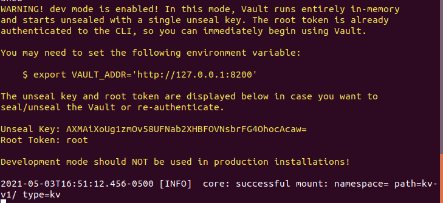
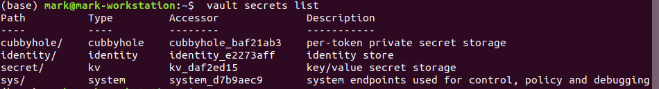
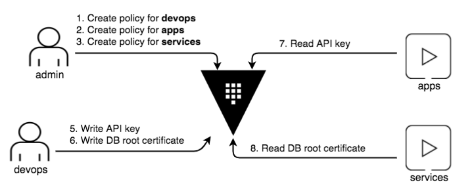

# Static secrets

* Store secrets using Vault  

## Lab Goals:

* Store Google API and MySQL credentials using the key/value secrets engine
* (In the intro, we stored a simple string)

### Builds on:
* [Install lab](../lab01)

### Time:
    * 30 min

### Step 0) Lab plan

* We will do the following

* Start Vault
* Enable KV Secrets Engine
* Store the Google API key
* Store the root certificate for MySQL
* Generate a token for apps
* Retrieve the secrets




### Step 1) Start the dev server

* In a separate terminal, start a Vault dev server with root as the root token.

```shell
vault server -dev -dev-root-token-id root
```

* The Vault dev server is now running at 127.0.0.1:8200. The server is initialized and unsealed.



### Step 2) Export environment variables

```shell
export VAULT_ADDR=http://127.0.0.1:8200
```

```shell
export VAULT_TOKEN=root
```

### Step 3)

* List enabled secrets engines.

```shell
vault secrets list
```



* Now run with the -detailed flag and observe the output

```shell
vault secrets list -detailed
```

* Enable the key/value secrets engine v1 at kv-v1/.

```shell
vault secrets enable -path="kv-v1" kv
```
### Step 4) Store the Google API key

* Everything after the kv-v1 path is a key-value pair to write to the secrets engine. You can specify multiple values. If the value has a space, you need to surround it with quotes. Having keys with spaces is permitted, but strongly discouraged because it can lead to unexpected client-side behavior.

* Let's assume that the path convention in your organization is kv-v1/<OWNER>/apikey/<APP> for API keys. To store the Google API key used by the engineering team, the path would be kv-v1/eng/apikey/Google. If you have an API key for New Relic owned by the DevOps team, the path would look like kv-v1/devops/apikey/New_Relic.

* The command to set key/value secrets is

```shell
 vault kv put kv-v1/<PATH> <KEY>=VALUE>
```

* The <PATH> can be anything you want it to be, and your organization should decide on the naming convention that makes most sense.

* Specifically, create a secret at path kv-v1/eng/apikey/Google with a key set to AAaaBBccDDeeOTXzSMT1234BB_Z8JzG7JkSVxI.

```shell
vault kv put kv-v1/eng/apikey/Google key=AAaaBBccDDeeOTXzSMT1234BB_Z8JzG7JkSVxI
```

* Observe the `success` status

* Read back the secret at path kv-v1/eng/apikey/Google

```shell
vault kv get kv-v1/eng/apikey/Google
```

* Observe the result being read back

### Store the root certificate for MySQL

* For the purpose of this lab, generate a mock certificate using OpenSSL.

```shell
openssl req -x509 -sha256 -nodes -newkey rsa:2048 -keyout selfsigned.key -out cert.pem
```

* Give all the reasonable answers and verify the cert.pem key

* If you do not have the `openssl`, just copy the below cert and save it as `cert.pem`

```text
-----BEGIN CERTIFICATE-----
MIICyjCCAbICCQDrpZYh8et7yTANBgkqhkiG9w0BAQsFADAnMQswCQYDVQQGEwJV
UzELMAkGA1UECAwCQ0ExCzAJBgNVBAcMAlNGMB4XDTE4MTExMjIwNDEwNVoXDTE4
MTIxMjIwNDEwNVowJzELMAkGA1UEBhMCVVMxCzAJBgNVBAgMAkNBMQswCQYDVQQH
DAJTRjCCASIwDQYJKoZIhvcNAQEBBQADggEPADCCAQoCggEBAJnIdgpml8+xk+Oj
1RGMCyJ1P15RiM6rdtszT+DFBg893Lqsjoyd5YgwELLz0Ux8nviG4L5OXOujEpAP
2cQBxTSLQjBELBZY9q0Qky3+2ewqV6lSfcXrcf/JuDJGR5K8HSqwNG35R3WGnZ+O
JhY0Dmx06IAs/FF8gP88zTQ8M7zuaThkF8MaF4sWPf6+texQwjzk4rewknGBFzar
9wFxVwNCyDD6ewIYPtgDxdJ1bwBVoX3KKKXm8GStl/Zva0aEtbSq/161J4VbTro2
dxArMPKzxjD6NLyF59UNs7vbzyfiw/Wq7BJzU7Kued5KdGt0bEiyWZYO+EvvxGmE
1pHfqysCAwEAATANBgkqhkiG9w0BAQsFAAOCAQEAavj4CA+7XFVHbwYMbK3c9tN/
73hkMvkAZWix5bfmOo0cNRuCeJnRIX+o6DmusIc8eXJJJV/20+zoSvUwlsLDPXoN
+c41GfIiEUSaSdSBtETMy8oPga718nIwAvNgYiUHXnV3B0nLYBUpYSnsD00/6VXG
xZUIEVBd7Ib5aRwmK8U5drxoWaBoG5qdvH9iapwTrCcPsRjsLBq7Iza2oBORGlfF
CjqiW2+KJzwRiTQj70yceniGVHM+VSpFYCLJ0mXeyLfITy7joqxr4AGYz+EhpLuf
iDpYDNYlr0JDVQqogskWjrnWOh0YcIJKgVtiTh2HDM5TdQgeXg4wv5IqLok0Tw==
-----END CERTIFICATE-----
```

* The command is basically the same as the Google API key example. The path convention for certificates is kv-v1/<ENVIRONMENT>/cert/<SYSTEM>. To store the root certificate for production MySQL, the path becomes kv-v1/prod/cert/mysql.

* Create a secret at path kv-v1/prod/cert/mysql with a cert set to file contents for cert.pem.

```shell
vault kv put kv-v1/prod/cert/mysql cert=@cert.pem
```

* How does it work? -Any value that begins with @ indicates a file name. Data will be loaded from this file.

### Step 5) Generate a token for apps

* To read the secrets, apps persona needs "read" ability on those secrets engine paths.

* Create a policy file named apps-policy.hcl that permits the read to the paths kv-v1/eng/apikey/Google and kv-v1/prod/cert/mysql.

```shell
tee apps-policy.hcl <<EOF
# Read-only permit
path "kv-v1/eng/apikey/Google" {
  capabilities = [ "read" ]
}

# Read-only permit
path "kv-v1/prod/cert/mysql" {
  capabilities = [ "read" ]
}
EOF
```

* First create apps policy

```shell
vault policy write apps apps-policy.hcl
```

* Create a variable that stores a new token with apps policy attached

```shell
APPS_TOKEN=$(vault token create -policy="apps" -field=token)
```

* Display the token.

```shell
echo $APPS_TOKEN
```

* Now apps can use this token to read the secrets.

* NOTE: For the purposes of this lab, you created a policy for the apps persona, and generated a token for it. However, in the real world, you may have a dedicated policy author, or admin to write policies. Also, the consumer of the API key may be different from the consumer of the root certificate. Then each persona would have a policy based on what it needs to access.



### Step 6) Retrieve the secrets

* Command

```shell
vault kv get kv-v1/<PATH>
```

* Authenticate with the apps token.

```shell
vault login $APPS_TOKEN
```

* Read the secret at the path kv-v1/eng/apikey/Google

```shell
vault kv get kv-v1/eng/apikey/Google
```

* Observe the values read

* To read only the key field at the path kv-v1/eng/apikey/Google

```shell
vault kv get -field=key kv-v1/eng/apikey/Google
```

* To read only the cert field at the path kv-v1/prod/cert/mysql.

```shell
vault kv get -field=cert kv-v1/prod/cert/mysql
```

### Step 7) Congratulations!