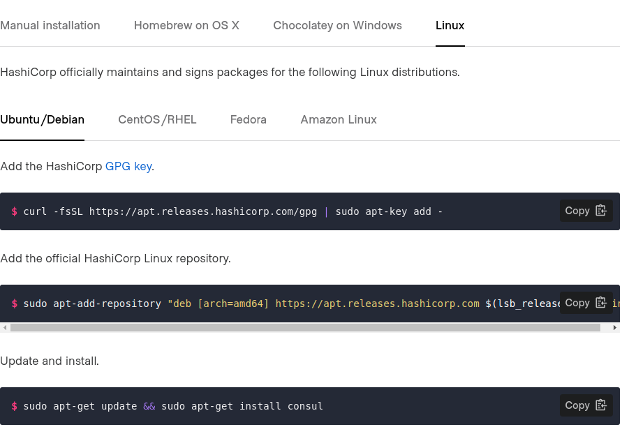

# Consul install

## Lab Goals:

* Install Consul 

### Builds on:
* None

### Time:
    
    * 15 min

### Step 1) Install

* The first thing you need to do in order to use Consul is to install it. In a production deployment you would install Consul on every node where you want to register services, but in this tutorial, you will install it locally so that you can use it to explore Consul's core capabilities. Consul is distributed as a binary or as a package for the major operating systems.



* Now continue [here](https://learn.hashicorp.com/tutorials/consul/get-started-install?in=consul/getting-started), follow instructions for your OS

### Step 2) Verify the install

```terraform
consul
```

### Step 3) Congratulations!